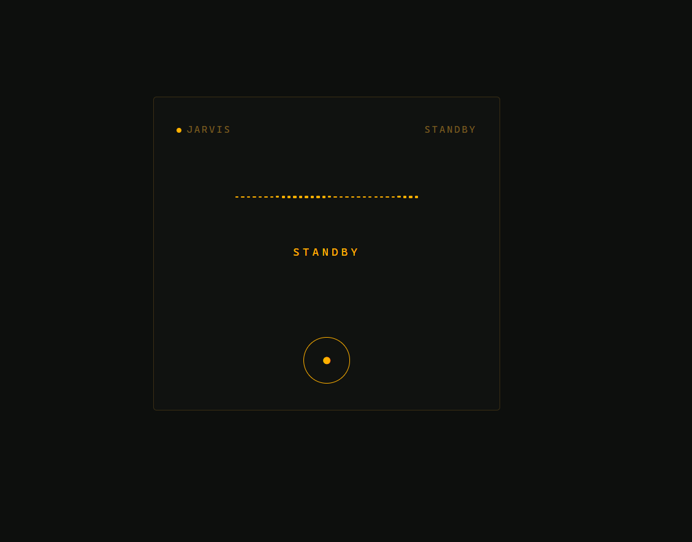
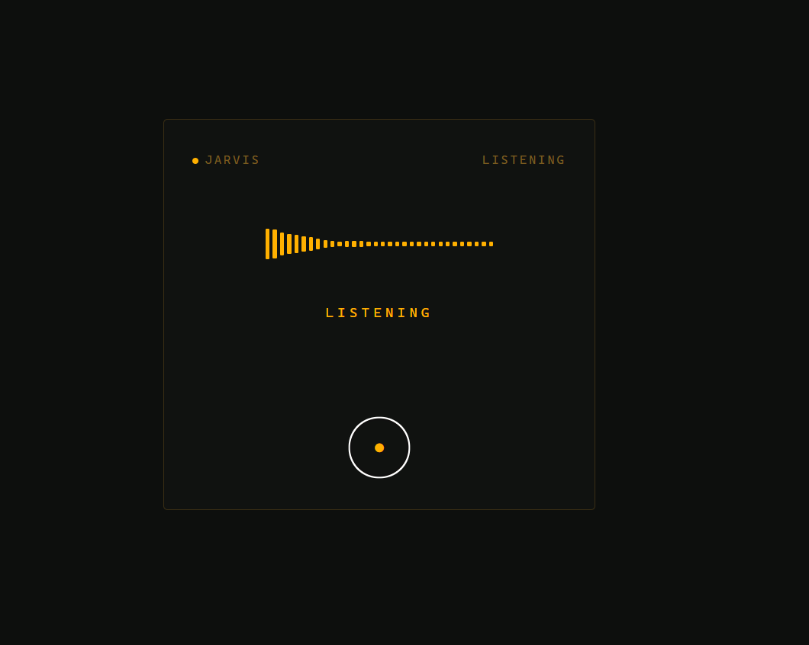
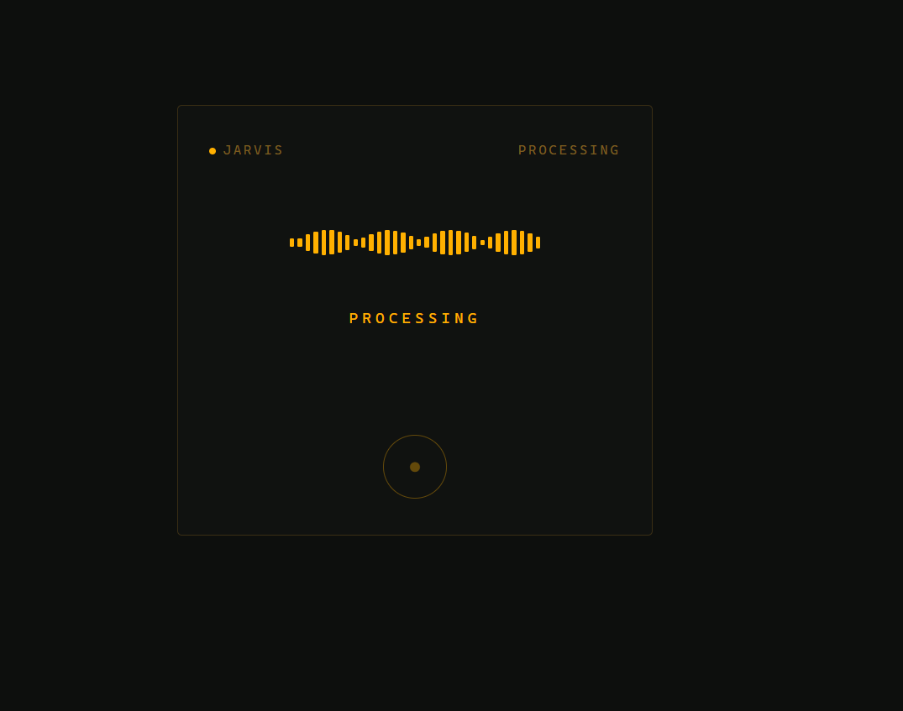
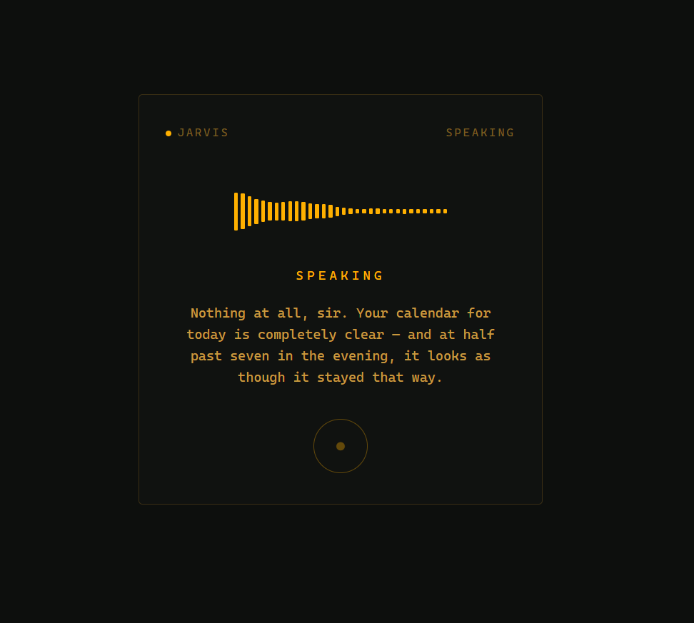

# JARVIS

A voice-controlled personal assistant for Google Calendar and Google Tasks — built from scratch around one core engineering principle: **never trust the AI to reliably do the right thing. Build the system so it doesn't matter if it doesn't.**

Runs as a small FastAPI server with a browser-based voice console. Talk to it, and it manages your calendar and to-do list — proposing changes, asking for confirmation, and proactively reminding you about what's coming up, all without you needing to ask.


---

## Why this exists — the design philosophy

Large language models are probabilistic. A model that behaves correctly a hundred times in a row is not guaranteed to behave correctly the hundred-and-first time — with zero change to the prompt, zero change to the code, no warning at all. Most AI-agent projects handle this by writing a careful system prompt and hoping it holds. This project doesn't.

Every place in this codebase where the model's behavior actually matters, there's a deterministic, code-level backstop that doesn't depend on the model getting it right — the same way a car's airbag doesn't depend on the driver being skilled. The manufacturer doesn't try to make every driver crash-proof; they assume a crash will eventually happen and build a safety buffer that's there regardless of who's driving. This codebase applies the same logic to every AI output.

**Concretely, that means:**

- **Writing to your calendar or tasks is never one step.** The LLM can *propose* a change, but the code that actually performs it is a completely separate function — the model is structurally incapable of writing anything on its own. A second guard refuses any attempt to confirm a proposal in the same turn it was made, and the "confirm" action isn't even offered to the model unless a proposal is genuinely waiting from an earlier turn.
- **Ambiguity is resolved by code, not by the model guessing.** If a spoken request could refer to more than one event or task, the system detects that and asks a clarifying question — it never lets the model silently pick one.
- **Nothing the model produces reaches your ears unfiltered.** Every reply is passed through a deterministic cleanup pass before speech synthesis, regardless of what the prompt asked for — because "the prompt told it not to" is a request, not a guarantee.
- **Raw errors are never spoken aloud.** If a transcription service, the language model, or a Google API call fails, the real technical error is logged for debugging — what you actually hear is always a plain, human sentence.
- **Every external call — the LLM, speech-to-text, calendar/task writes — follows one uniform retry policy**: try once, retry once, then fail loudly and clearly. No silent failures, no infinite retries, no unpredictable behavior depending on which part of the system happens to be talking to which API.
- **Proactive reminders are pure date/time comparisons against real data**, not something the model is trusted to remember to bring up.

The result: the AI can be exactly as unpredictable as it's going to be on any given day, without that unpredictability ever reaching the person using it.


---

## Features

- Natural voice conversation for managing Google Calendar and Google Tasks — create, edit, delete, and complete, all through normal spoken requests
- Every write is proposed and read back for confirmation before anything is saved
- Proactive, unprompted reminders — the nearest upcoming event when it's getting close, and tasks due today, mentioned automatically in conversation
- Swappable AI providers by design — the LLM, speech-to-text, and text-to-speech are each isolated behind a single interface, so switching providers is a config change, not a rewrite
- Automatic text-to-speech fallback (a second engine takes over transparently if the primary one fails)
- A small, distinctive browser console UI with a real audio-reactive waveform, not a canned animation
- Designed to run on genuinely modest hardware — developed and deployed on a repurposed Android phone running Termux, not a cloud VM

---

## Screenshots

The console has four distinct states, each visually and texturally different — not just recolored, since each represents something different actually happening (a real audio-reactive waveform for listening/speaking, a synthetic searching pattern while the LLM is thinking):

| Standby | Listening |
|---|---|
|  |  |

| Processing | Speaking |
|---|---|
|  |  |

---

## Architecture at a glance

```
Voice in → transcription → LLM (tool-calling) → propose/confirm safety layer → Google Calendar/Tasks
                                                                              ↘ spoken reply out
```

The codebase is organized so each concern lives in exactly one place:

| File | Responsibility |
|---|---|
| `main.py` | FastAPI server — voice/text endpoints, serves the frontend |
| `agent.py` | The orchestrator — conversation flow, the propose/confirm safety mechanism, proactive reminders |
| `calendar_tools.py` / `tasks_tools.py` | Pure Google Calendar/Tasks operations — no awareness of confirmation logic, just CRUD |
| `llm_client.py` | LLM provider wrapper (any OpenAI-compatible endpoint) |
| `stt_groq.py` / `tts_fish.py` / `tts_edge.py` | Speech-to-text and text-to-speech providers, each swappable independently |
| `google_auth.py` / `setup_google_auth.py` | Google OAuth credential handling and one-time setup |
| `time_utils.py` | Single shared source of truth for the current time and timezone |
| `retry.py` | The one shared retry policy every external call goes through |
| `config.py` | Reads `.env`, exposes which provider is active for each swappable piece |
| `text_match.py` | Fuzzy matching for resolving spoken references ("the dentist one") to real calendar/task entries |
| `index.html` / `app.js` | The browser voice console — mic capture, playback, and the live waveform display |

---

## Tech stack

- **Backend:** Python, FastAPI
- **LLM:** any OpenAI-compatible endpoint (built and tested against DeepSeek)
- **Speech-to-text:** Groq (Whisper)
- **Text-to-speech:** Fish Audio (primary), edge-tts (automatic fallback)
- **Calendar/Tasks:** Google Calendar API, Google Tasks API
- **Frontend:** vanilla HTML/CSS/JavaScript, Web Audio API for real-time audio visualization — no framework, no build step

---

## Setup

### 1. Clone and install dependencies

```bash
git clone https://github.com/Alli667i/Jarvis.git
cd Jarvis
pip install -r requirements.txt
```

### 2. Set up Google OAuth

1. Go to the [Google Cloud Console](https://console.cloud.google.com/), create or select a project.
2. Enable the **Gmail API**, **Google Calendar API**, and **Google Tasks API**.
3. Under Credentials, create an **OAuth client ID** of type **Desktop app**, and download the resulting JSON.
4. Save it as `credentials.json` in the project root.
5. Run the one-time login script — this needs a real browser, so run it on your own computer, not a headless server:
   ```bash
   python setup_google_auth.py
   ```
   This opens a browser for you to log in and approve access, then writes `token.json`. If you're deploying to a headless machine, copy `token.json` there afterward — `credentials.json` itself doesn't need to go with it.

### 3. Configure your `.env`

Create a `.env` file in the project root:

```bash
# LLM (any OpenAI-compatible endpoint)
LLM_API_KEY=your-key-here
LLM_BASE_URL=https://api.deepseek.com
LLM_MODEL=deepseek-v4-flash

# Speech-to-text
GROQ_API_KEY=your-groq-key

# Text-to-speech
TTS_ENGINE=fish
FISH_API_KEY=your-fish-audio-key
FISH_REFERENCE_ID=            # optional — leave blank to use the default voice
```

### 4. Run it

```bash
python main.py
```

Then open `http://localhost:8001` in a browser. Tap the mic, talk naturally, and it'll transcribe, understand, and (after your confirmation) act on requests involving your calendar and tasks.

---

## A note on where this runs

This was built and is actively used on a Samsung A40 running Termux — a five-year-old Android phone repurposed into a personal server, not a cloud instance. It runs on any standard Python environment too; the Termux-specific setup is only relevant if you're deploying to Android the same way.

---

## Status

Actively developed. The core voice + calendar/task loop is complete and in daily use.

